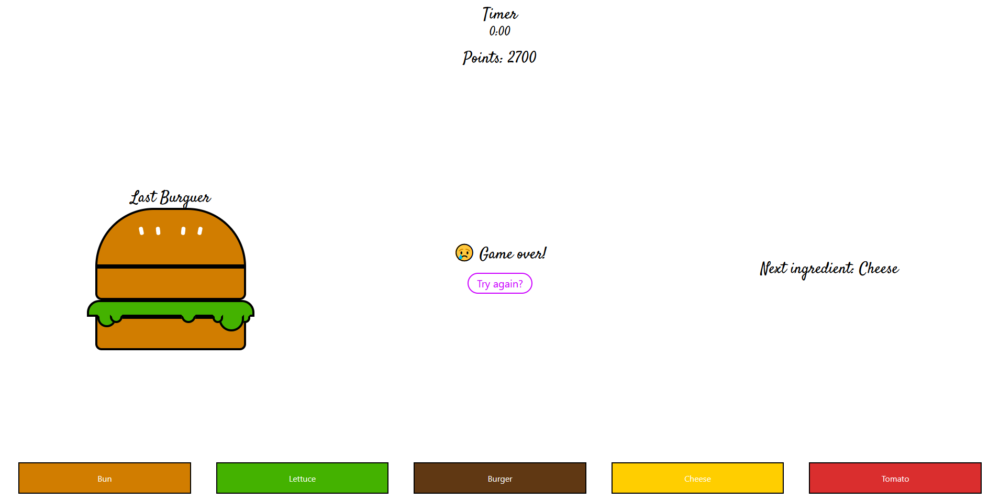

# Burger Stacker game 🍔!

## 👀 Project Overview

- 😎 A fast minigame, where you build random burgers to gain the highest points in 30 seconds!
- 👨‍💻 Uses React for faster use of state and DOM items. TailwindCSS for the styling.
- 🔗 You can find this project live on: https://burger-stacker.ribamarf01.dev/.

## 🔥 Techs used

<div style="
    display: inline-block
">
    
    
    
</div>

## 🔧 Build Setup

```bash
# install dependencies
$ npm install || yarn

# server with hot reload at localhost:3000
$ npm run dev || yarn dev

# build for production
$ npm run build || yarn build

# run the serverside app
$ npm run start || yarn start

```

## 📷 Project images




## 👽 External links

- 🔗 
